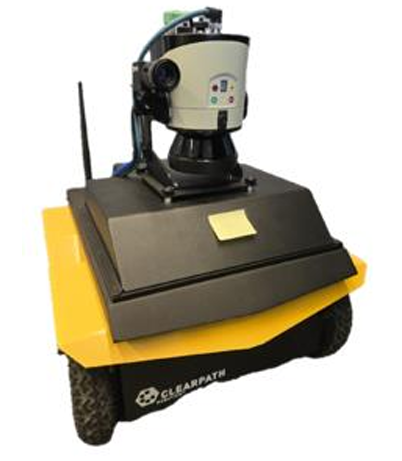
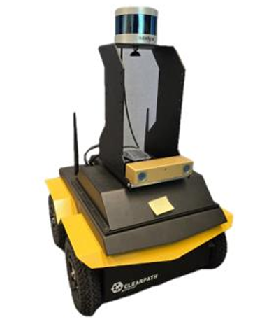

# SLAM with Jackal UGV Project

This project implements 2D SLAM and autonomous navigation for Clearpath Jackal UGVs using ROS, in both Gazebo simulated and real environments. It covers navigation, gmapping, and localization, along with instructions for workspace setup and establishing connections between Jackal robots and remote devices.

Developed by Anton Trublin as part of the YorkU RAY program at York University, under the supervision of Prof. Costas Armenakis, PEng.

## Robot Platform

Two Jackal UGVs were utilized in this project, each with a distinct sensor configuration:

<table>
  <tr>
    <td>
    
Jackal 1
</td>
    <td>
      - Camera: Point Grey Flea3 
      - 2D LiDAR: SICK LMS111 
      - IMU: MicroStrain 3DM-GX5-25
    </td>
    <td>
    
Jackal 2
</td>
    <td>
      - Camera: Stereo Bumblebee BB2 
      - 3D LiDAR: Puck LITE Velodyne VLP-16 
      - IMU: MicroStrain 3DM-GX5-25
    </td>
  </tr>
</table>

## Demo Videos

The following videos demonstrate 2D SLAM (using gmapping) and dynamic obstacle avoidance (during localization) in both Gazebo simulation and real environments using two Jackal platforms.

#### Full videos with higher quality can be viewed via the links below:

### SLAM (gmapping) with Gazebo

[Link to Jackal gmapping with Gazebo](https://drive.google.com/file/d/17Sv-ov9Swhs6AZY9-54BHi-h3nHwJ0zW/view)

  

### Dynamic obstacle avoidance (localization) with Gazebo

[Link to Jackal localization with Gazebo](https://drive.google.com/file/d/1QzJ4Q-RuvKa2QtajLESE4XeJjScEocde/view)

  

### SLAM (gmapping) with Jackal 1

[Link to Jackal 1 gmapping in real environment](https://drive.google.com/file/d/1KalWldOSjY0e3EDhIbN7KeGoV3Dc38Ee/view)

  

### Dynamic obstacle avoidance (localization) with Jackal 1

[Link to Jackal 1 localization in real environment example 1](https://drive.google.com/file/d/1HEVnrSPohhcd4nkFsCFLTRPruPQncvNW/view)

  

[Link to Jackal 1 localization in real environment example 2](https://drive.google.com/file/d/1xy9nevqT50cjugIHf5Tl9ZtXu3YT_T9c/view)

  

### SLAM (gmapping) with Jackal 2

[Link to Jackal 2 gmapping in real environment](https://drive.google.com/file/d/1AG-RoXqj5g46r8V6VE3--_nUpYgGnD_F/view)

  

